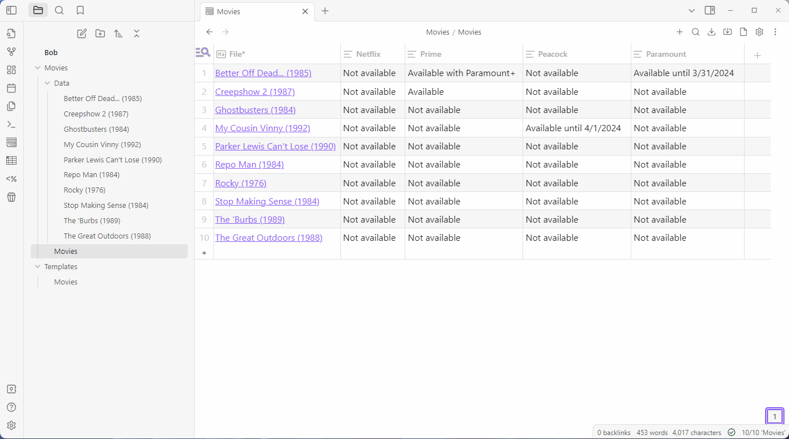

# Who Is Streaming Plugin

Lookup which streaming services a movie is available to stream on in your [Obsidian](https://obsidian.md) notes with the [Streaming Availability API](https://www.movieofthenight.com/about/api) by Movie of the Night. Details about the movie and streaming status will be added as front matter. 

## How to use?

The plugin requires an [API Key](https://rapidapi.com/movie-of-the-night-movie-of-the-night-default/api/streaming-availability/pricing) for the Streaming Availability API. After signing up for an API Key, enter the key into the settings page, choose your country and select which streaming services you are interested in. 

Then create a new note, enter a movie or TV show as the name of the note, then use the popcorn ribbon button or `Who Is Streaming` command. The title of the note will be used to search the Streaming Availability API. A list of options will be presented to choose from. After syncing a note once, the `tmdb_id` and `Type` properties will be used to sync directly without the need for a search. 

